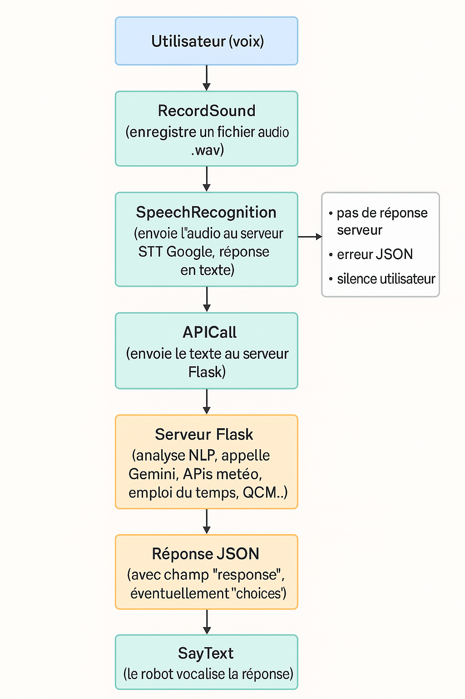

# Chatbot vocal interactif pour le robot Pepper

## Objectif du projet

Ce projet vise à intégrer un chatbot vocal intelligent dans le robot humanoïde **Pepper**, capable d’interagir naturellement avec un utilisateur. Le robot peut répondre à des questions concernant :

- la météo d'une ville à une date/heure donnée,
- l’emploi du temps universitaire par formation, jour et heure,
- des quiz interactifs en informatique et mathématiques.

Ce projet a été réalisé dans le cadre du Master 1 Intelligence Artificielle (Université d’Avignon), en combinant robotique, traitement du langage naturel, APIs, et modèles de langage (LLM).

---

## Architecture du système

L’architecture repose sur une séparation claire entre :

- **l’interface robotique** (via Choregraphe et NAOqi) : qui enregistre, envoie et vocalise,
- **le backend Python** : qui comprend, décide et génère la réponse.

### Chaîne d’interaction

1. L’utilisateur parle à Pepper.
2. Pepper enregistre l’audio (RecordSound).
3. Le fichier est envoyé à un serveur de transcription vocale Google ASR.
4. Le texte transcrit est envoyé à une API Flask.
5. Le backend traite la demande (via Gemini, FastAPI, APIs météo/EDT/quiz).
6. Le robot reçoit une réponse textuelle + options (QCM) et la vocalise.

### Schéma du système



---

## Lancer le projet

### 1. Lancer le serveur Flask (chatbot principal)

```bash
python app.py
```

### 2. Lancer l'API emploi du temps (FastAPI)

```bash
uvicorn API_EDT:app --reload
```

### 3. Lancer le serveur Google Speech-to-Text

```bash
python googleSR_server.py
```

### 4. Connecter le comportement Choregraphe au robot (via IP Pepper)

Charger le comportement complet .pml

Lier les boxes : RecordSound → SpeechRecognition → APICall → SayText

Activer le micro → lancer l’écoute → obtenir la réponse

1. Dépendances à installer
Installe les paquets nécessaires avec pip ou via un environnement Conda :

pip install flask fastapi uvicorn spacy requests dateparser python-dotenv speechrecognition pydub google-generativeai aiofiles
python -m spacy download fr_core_news_sm

Ou en utilisant le fichier requirements.txt :

```bash
pip install -r requirements.txt
python -m spacy download fr_core_news_sm
```

NB : Assure-toi d’avoir une clé API Gemini valide dans un fichier .env si tu utilises le LLM Google.

2. Exemples d’interaction

📍 Météo
Utilisateur : « Quelle sera la météo à Paris demain à 14h ? »
Pepper : « Demain à 14h à Paris, il fera 16°C avec un temps ensoleillé. »

📍 Emploi du temps
Utilisateur : « Quel est le cours de M1 IA le 22 avril à 9h ? »
Pepper : « C’est cours de Machine Learning en salle A201. »

📍 Quiz
Utilisateur : « Pose-moi une question en informatique. »
Pepper : « Quelle est la complexité moyenne d'une recherche dichotomique ?
Option 1 : O(n), Option 2 : O(log n), Option 3 : O(n log n) »

3. Fonctionnalités clés
1. Requêtes météo avec date, heure, ville
2. Emploi du temps universitaire en temps réel
3. Quiz aléatoires par domaine (informatique, math)
4. Gestion des erreurs (ville absente, formation inconnue…)
5. Session QCM maintenue entre les requêtes via cookie HTTP
6. Requêtes vocales naturelles → robot répond oralement

## Remerciements

Ce projet a été réalisé dans le cadre du M1 Intelligence Artificielle (Université d’Avignon).

## Licence

Ce projet est sous licence MIT. Vous êtes libre de le réutiliser, le modifier et le diffuser à condition de créditer l’auteure du projet.

Réalisé par
Ould Ammar Sofia
📧 <sofia.ould-ammar@alumni.univ-avignon.fr>
